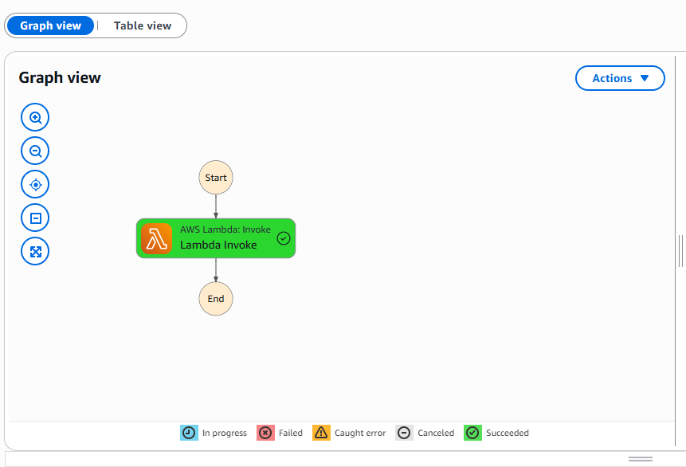

# 🚀 Creating My First AWS Step Function (Using AWS Console)

This guide helps you build your first AWS Step Function through the **AWS Management Console**, using a simple "Hello World" Lambda function written in Python.

---

## 📋 Prerequisites

- AWS Account
- IAM permissions to create Lambda, IAM roles, and Step Functions
- Basic familiarity with AWS Console

---

## 1. 🛡️ Create a Lambda Execution Role

1. Go to the **IAM Console**: [https://console.aws.amazon.com/iam](https://console.aws.amazon.com/iam)
2. In the left sidebar, click **Roles**, then click **Create role**.
3. Choose **AWS service** > Use case: **Lambda**, then click **Next**.
4. In **Permissions**, search for and select:
   - `AWSLambdaBasicExecutionRole`
5. Click **Next**, name the role (e.g., `LambdaBasicExecutionRole`), and create it.
6. Once created, copy the **Role ARN** — you’ll use it when creating your Lambda function.

---

## 2. 🐍 Create a Lambda Function for "Hello World"

1. Go to the **Lambda Console**: [https://console.aws.amazon.com/lambda](https://console.aws.amazon.com/lambda)
2. Click **Create function**.
3. Select **Author from scratch**:
   - Name: `HelloWorldFunction`
   - Runtime: `Python 3.x`
   - Permissions: Choose **Use an existing role**, then select `LambdaBasicExecutionRole`
4. Click **Create function**.
5. In the **Function code** section, paste the following code:


```python
def lambda_handler(event, context):
    return {
        'statusCode': 200,
        'body': 'Hello, World from Lambda!'
    }
```
6. Click Deploy to save the code.

## 3.1 📄 Create Your State Machine with Code

1. Go to the **Step Functions Console**: [https://console.aws.amazon.com/states](https://console.aws.amazon.com/states)

2. Click **Create state machine**.

3. Choose **Write your workflow in code**.

4. Paste the following code into the **definition editor**:

```json
{
  "Comment": "A simple Hello World example",
  "StartAt": "HelloWorld",
  "States": {
    "HelloWorld": {
      "Type": "Task",
      "Resource": "arn:aws:lambda:<your-region>:<your-account-id>:function:HelloWorldFunction",
      "End": true
    }
  }
}
```

> 📝 Replace `<your-region>` and `<your-account-id>` accordingly.

5. Under **Permissions** under Config **_(State machine configuration)_**, choose **Create a new IAM role** (or select an existing one with Step Functions permissions).
```
{
    "Version": "2012-10-17",
    "Statement": [
        {
            "Effect": "Allow",
            "Action": [
                "lambda:InvokeFunction"
            ],
            "Resource": [
                "arn:aws:lambda:us-east-1:<your-account-id>:function:HelloWorldFunction:*"
            ]
        },
        {
            "Effect": "Allow",
            "Action": [
                "lambda:InvokeFunction"
            ],
            "Resource": [
                "arn:aws:lambda:us-east-1:<your-account-id>:function:HelloWorldFunction"
            ]
        }
    ]
}
```
6. Name your state machine: `HelloWorldStateMachine`

7. Click **Create state machine**.

---

## 3.2 ▶️ Start Your State Machine

1. In the **Step Functions Console**, select your newly created state machine.

2. Click **Start execution**.

3. You can optionally enter a name or input JSON.

4. Click **Start execution**.

✅ You should see your execution succeed and output `"Hello, World from Lambda!"`.




**Step Functions Execution States**

---

## ✅ What's Next?

* Try chaining multiple Lambda functions
* Add error handling with `Catch` and `Retry`
* Explore integrations with other AWS services

---

## 📚 References

* [AWS Step Functions Documentation](https://docs.aws.amazon.com/step-functions/latest/dg/welcome.html)
* [AWS Lambda Documentation](https://docs.aws.amazon.com/lambda/latest/dg/welcome.html)
* [IAM Roles and Policies](https://docs.aws.amazon.com/IAM/latest/UserGuide/id_roles.html)

